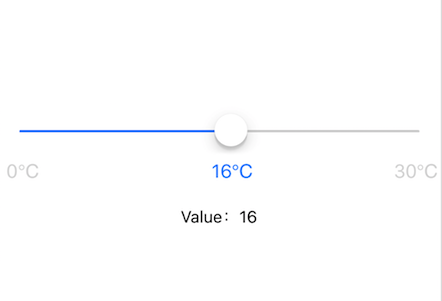

# react-native-mark-slider

A marked slider component base on React Native [Slider component](https://facebook.github.io/react-native/docs/slider).

<div align=center></div>

## Usage

```bash
$ npm i react-native-mark-slider
```

```js
import React, { Component } from 'react';
import { StyleSheet, View, Text } from 'react-native';
import MarkSlider from 'react-native-mark-slider';

export default class App extends Component {
  state = {
    value: 0,
  };

  render() {
    const marks = [
      { name: '0℃', value: 0 },
      { name: '16℃', value: 16 },
      { name: '30℃', value: 30 },
    ];
    return (
        <View style={styles.container}>
          <MarkSlider
              step={1}
              max={30}
              marks={marks}
              onChange={value => this.setState({ value })}
          />
          <View style={{ alignItems: 'center' }}>
            <Text>Value：{this.state.value}</Text>
          </View>
        </View>
    );
  }
}

const styles = StyleSheet.create({
  container: {
    flex: 1,
    justifyContent: 'center',
  },
});
```

## Configuration

Support all the properties of React Native Slider, except some property names that have been adjusted.

|Property|Type|Default|Description|
|:---|:---|:---|:---|
|marks|object[]|null|Tick marks of slider.The item value must be `number`, and must in closed interval min, max. |
|min|number|0|Initial minimum value of the slider.|
|max|number|1|Initial maximum value of the slider.|
|onChange|function|null|Callback continuously called while the user is dragging the slider.|
|onAfterChange|function|null|Callback that is called when the user releases the slider.|